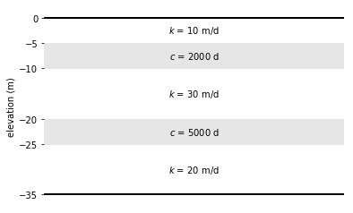
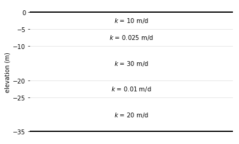
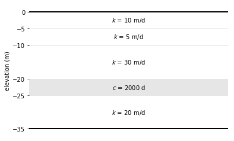

Starting a Model
----------------

There are three ways to start a model:

1. :class:`~timml.model.ModelMaq`, which is model consisting of a regular sequence of aquifer - leaky layer - aquifer - leaky layer, aquifer, etc.
The top of the system can be either an aquifer or a leaky layer. The head is computed in all aquifer layers only.

.. code-block:: python

   ml = ModelMaq(kaq=[10, 30, 20], z=[0, -5, -10, -20, -25, -35], c=[2000, 5000])

    A `ModelMaq` example with three aquifers and two leaky layers

2. :class:`~timml.model.Model3D`, which is a model consisting of a stack of aquifer layers. The resistance between the aquifer layers is computed
as the resistance from the middle of one layer to the middle of the next layer. Vertical anisotropy can be specified. The system
may be bounded on top by a leaky layer.

.. code-block:: python

    Model3D(kaq=[10, 0.0025, 30, 0.001, 20], z=[0, -5, -10, -20, -25, -35], kzoverkh=0.1)

    A  `Model3D` example consisting of five layers all treated as aquifers and a vertical anisotropy of 0.1

3. :class:`~timml.model.Model`, which is a model consisting of an arbitrary sequence of leaky layers and aquifers. The resistance between all aquifers needs to be specified by the user.
This is the most general option, but requires a bit more input.

.. code-block:: python

    Model(kaq=[10, 5, 30, 20], c=[2, 5, 2000], z=[0, -5, -10, -20, -25, -35], 
          npor=[0.3, 0.3, 0.3, 0.3, 0.3], ltype=['a', 'a', 'a', 'l', 'a'])

    A `Model` example with four aquifers and one leaky layer
    
.. toctree::
    :maxdepth: 1
    :hidden:
    
    ModelMaq <modelmaq>
    Model3D <model3d>
    Model <model>